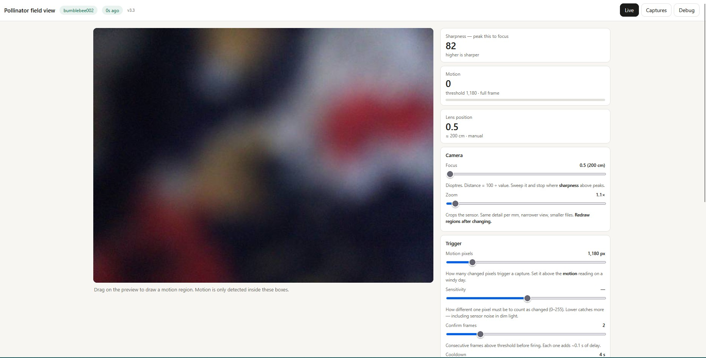
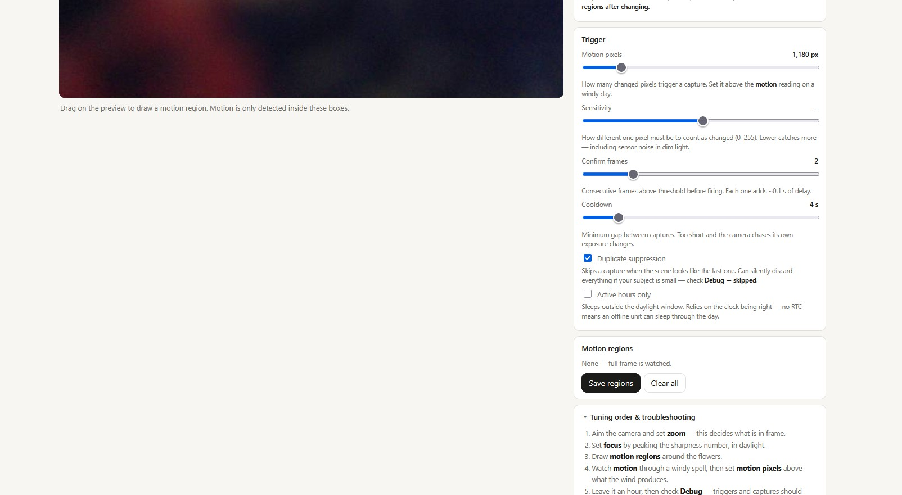
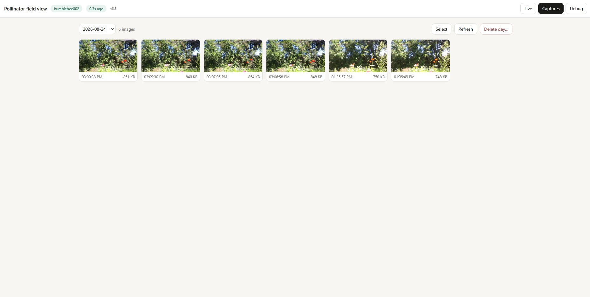
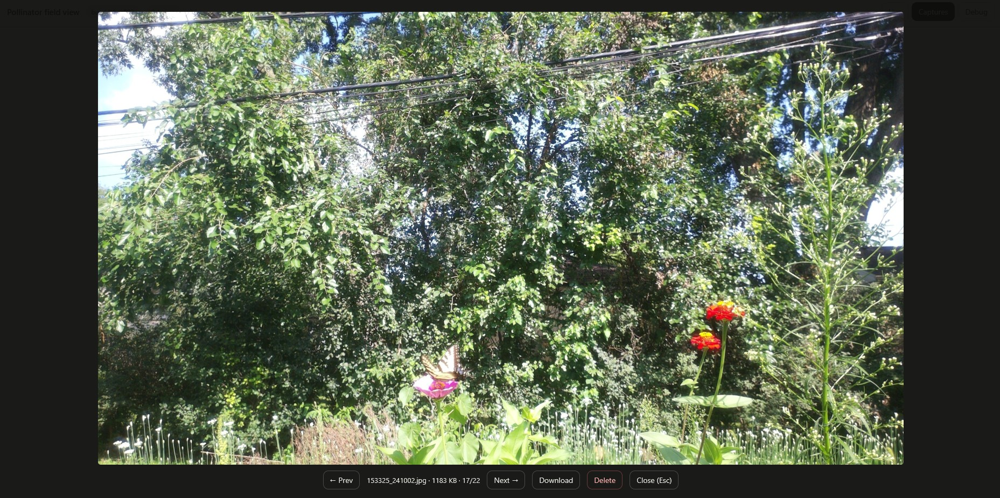
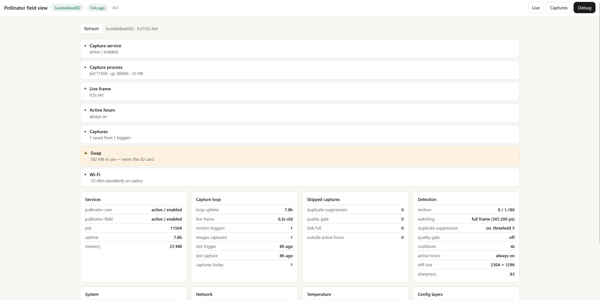
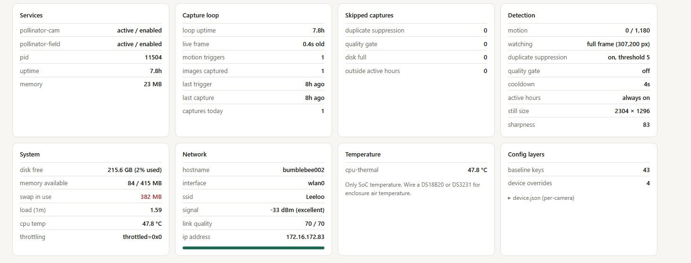

## Screenshots

## Config layering
    code defaults  ->  baseline.json  ->  device.json     (rightmost wins)
Delete a key from device.json to fall back to the baseline value.

## Install on a new Pi
    sudo ./install.sh
    sudo nano /etc/pollinator/device.json
    sudo systemctl restart pollinator-cam
